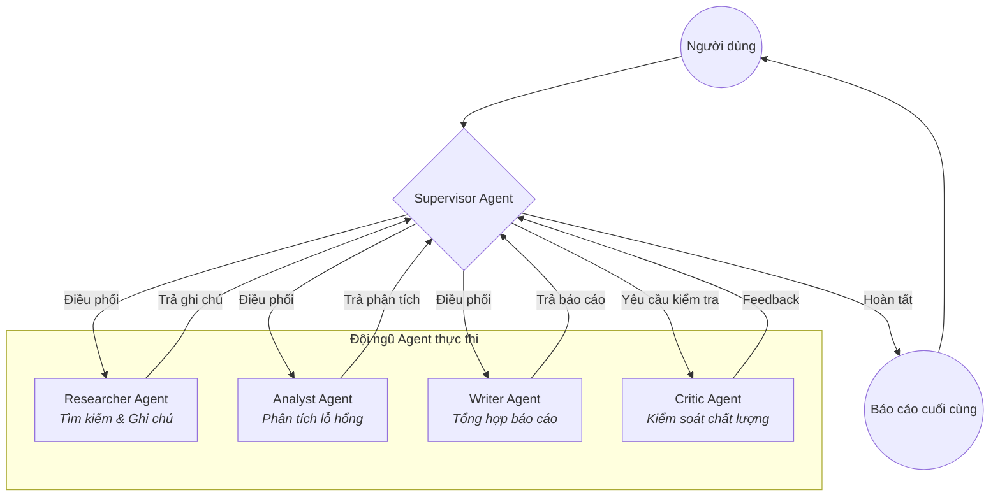

# Hệ thống Nghiên cứu Đa tác nhân (Multi-Agent Research System)

Chào mừng bạn đến với **Multi-Agent Research System**, một hệ thống nghiên cứu tự động mạnh mẽ được xây dựng trên nền tảng LangChain và LangGraph. Hệ thống sử dụng kiến trúc đa tác nhân (Multi-Agent) để thu thập thông tin, phân tích sâu và tổng hợp báo cáo chuyên nghiệp.

## 🌟 Tính năng nổi bật

- **Kiến trúc Graph-based**: Sử dụng LangGraph để điều phối luồng làm việc giữa các Agent.
- **Phân vai chuyên biệt**: Mỗi Agent đảm nhận một nhiệm vụ riêng (Tìm kiếm, Phân tích, Viết bài, Phản biện).
- **Quan sát chi tiết**: Tích hợp LangSmith để theo dõi và debug toàn bộ quy trình chạy của Agent.
- **Đánh giá hiệu năng**: Công cụ Benchmark so sánh giữa mô hình Single-Agent và Multi-Agent.

## 🏗️ Cấu trúc hệ thống Agent

Hệ thống của chúng tôi hoạt động theo mô hình **Supervisor-Worker**, được xây dựng trên luồng đồ thị (Graph) như sau:



Các thành phần chi tiết:

1.  **Supervisor (Người điều phối)**: Nhận yêu cầu từ người dùng và quyết định Agent nào sẽ thực hiện bước tiếp theo. Nó kiểm soát luồng chạy của đồ thị (Graph).
2.  **Researcher (Chuyên viên nghiên cứu)**: Sử dụng Tavily Search API để tìm kiếm các nguồn tin uy tín trên Internet và tóm tắt ghi chú thô.
3.  **Analyst (Chuyên viên phân tích)**: Đào sâu vào các ghi chú nghiên cứu, tìm ra các lỗ hổng thông tin và các khía cạnh chuyên môn cần làm rõ.
4.  **Writer (Biên tập viên)**: Tổng hợp tất cả thông tin đã được phân tích thành một báo cáo hoàn chỉnh với cấu trúc chuyên nghiệp.
5.  **Critic (Phản biện)**: Kiểm tra lại báo cáo cuối cùng để đảm bảo tính chính xác, không bị ảo giác (hallucination) và đúng yêu cầu người dùng.

## 🛠️ Hướng dẫn cài đặt

### 1. Yêu cầu hệ thống
- Python 3.9+
- Tài khoản OpenAI API (để dùng LLM)
- Tài khoản Tavily API (để tìm kiếm web)
- Tài khoản LangSmith (để xem trace - tùy chọn)

### 2. Cài đặt môi trường
```bash
# Clone repository
git clone <your-repo-url>
cd <repo-folder>

# Cài đặt các thư viện cần thiết
pip install -e .
```

### 3. Cấu hình biến môi trường
Tạo file `.env` tại thư mục gốc và điền các thông tin sau:
```env
OPENAI_API_KEY=your_openai_key
TAVILY_API_KEY=your_tavily_key

# Cấu hình LangSmith (Tùy chọn để xem Trace)
LANGCHAIN_TRACING_V2=true
LANGCHAIN_API_KEY=your_langsmith_key
LANGCHAIN_PROJECT=Multi-Agent-Research
```

## 🚀 Cách sử dụng

### 1. Chạy nghiên cứu đa tác nhân
Đây là chế độ mạnh nhất, Agent sẽ phối hợp với nhau để tạo báo cáo:
```bash
python -m multi_agent_research_lab.cli multi-agent --query "Ứng dụng của GraphRAG trong ngân hàng"
```

### 2. Chạy nghiên cứu đơn lẻ (Baseline)
Chế độ này chỉ gọi một LLM duy nhất để trả lời nhanh:
```bash
python -m multi_agent_research_lab.cli baseline --query "GraphRAG là gì?"
```

### 3. Chạy báo cáo Benchmark
So sánh hiệu năng giữa hai chế độ trên và tạo file báo cáo tại `reports/benchmark_report.md`:
```bash
python scripts/run_benchmarks.py
```

## 📊 Quan sát và Đánh giá

- **Tracing**: Bạn có thể truy cập vào Dashboard của LangSmith để xem chi tiết từng bước tư duy của Agent.
- **Reports**: Báo cáo so sánh chất lượng, thời gian và chi phí nằm trong thư mục `reports/`.

---
